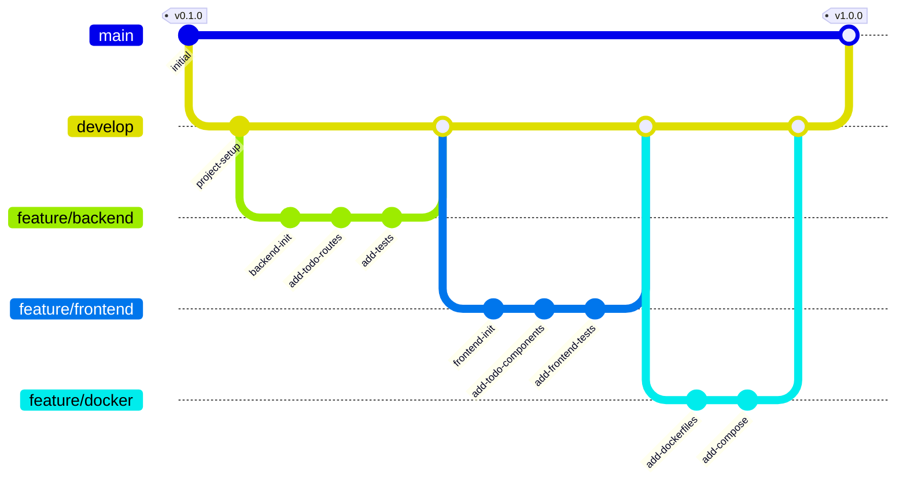

# Todo App with Node.js and Docker

A full-featured Todo List application built with Node.js, Express, and React, fully containerized with Docker.

## Project Structure

```
todo-app-nodejs-docker/
├── backend/                 # Node.js + Express backend
│   ├── src/                # Source files
│   ├── tests/              # Test files
│   └── Dockerfile         # Backend Docker configuration
├── frontend/               # React frontend
│   ├── src/               # Source files
│   ├── tests/             # Test files
│   └── Dockerfile         # Frontend Docker configuration
├── docker-compose.yml      # Docker compose configuration
└── README.md              # This file
```

## Development Workflow



## Features

- Create, Read, Update, and Delete todos
- Mark todos as complete/incomplete
- Filter todos by status
- Containerized application with Docker
- Comprehensive test coverage with Jest

## Getting Started

### Prerequisites

- Node.js 18.x or higher
- Docker and Docker Compose
- npm or yarn

### Development Setup

1. Clone the repository:
   ```bash
   git clone https://github.com/ajeetraina/todo-app-nodejs-docker.git
   cd todo-app-nodejs-docker
   ```

2. Install dependencies:
   ```bash
   # Install backend dependencies
   cd backend
   npm install

   # Install frontend dependencies
   cd ../frontend
   npm install
   ```

3. Run tests:
   ```bash
   # Backend tests
   cd backend
   npm test

   # Frontend tests
   cd frontend
   npm test
   ```

### Running with Docker

```bash
docker-compose up --build
```

The application will be available at:
- Frontend: http://localhost:3000
- Backend API: http://localhost:3001

## Test Coverage

Test results and coverage reports are available in the respective `coverage` directories:
- Backend: `backend/coverage/`
- Frontend: `frontend/coverage/`

## Contributing

Please read [CONTRIBUTING.md](CONTRIBUTING.md) for details on our code of conduct and the process for submitting pull requests.

## License

This project is licensed under the Apache 2.0 License - see the [LICENSE](LICENSE) file for details.